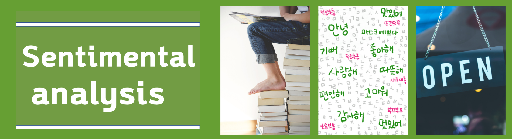
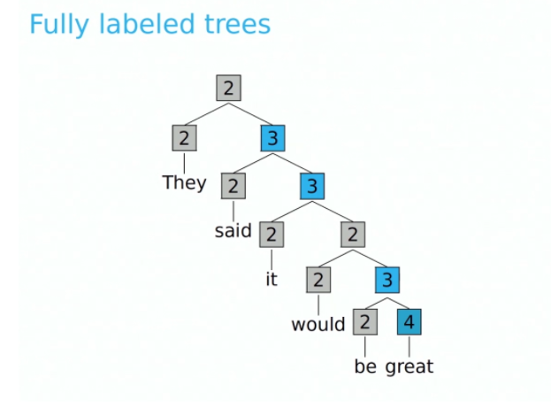
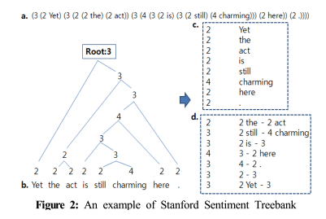
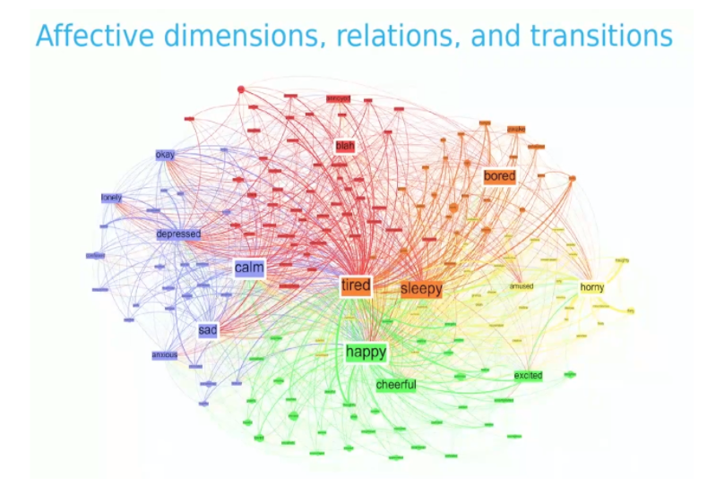
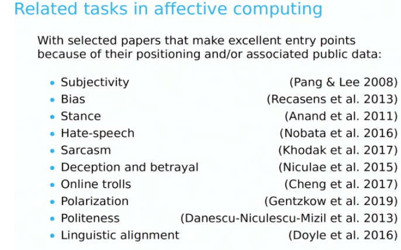
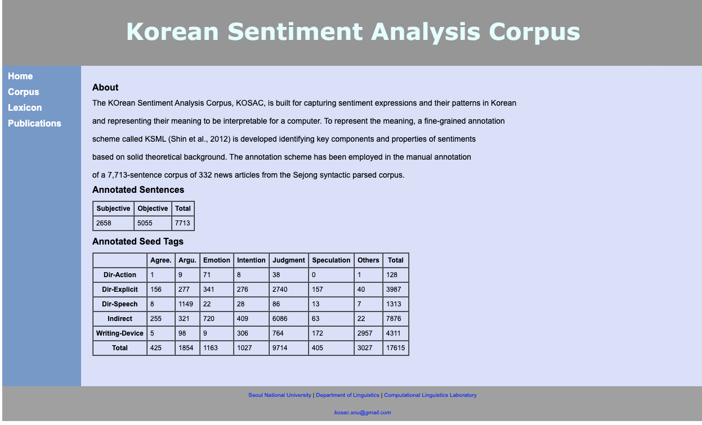

# 감정 재인과 감성 분석(Emotion recognition and sentimental analysis)

##  문제 정의 및 과제 분류
문제 정의
감성분석은 긍부정의 극성 분류로 활용되고 있는 분석이고, 감정 재인은 기쁨, 슬픔, 놀람 등의 다양한 감성을 분류하여 발화자의 기분(Mood)를 파악하는 분석이다. 따라서 정교하게 주석된 코퍼스가 필요하고 이를 통해 감성 어휘 측면에서의 분석뿐만 아니라 형태, 구문 태깅 등 다각도로 분석이 진행되고 있다.

(예) 스탠포드의 [Sentiment Treebank](https://nlp.stanford.edu/sentiment/treebank.html)

(예) 이성욱(2015)

이진트리 구조로 분석되어 있으며 각 노드는 0~4까지의 정수값을 가지는데 이 값은 긍정의 정도를 나타낸다(0:매우부정, 1:부정, 2:중립, 3:긍정, 4:매우긍정)으로 표기        

## 감정 재인과 감성 분석의 공통점과 차이점
1) 감정과 감성 분석의 공통점 :   
    ⓵ 불확실성 : 강한 긍정, 약한 긍정, 중립, 약한 부정, 강한 부정 등에 중간적 감정이 존재
           분노, 역겨움, 두려움, 중립, 슬픔, 놀람 등의 감정을 명확히 나누기 어려움

<이미지 출처 : Lecture 6 – Sentiment Analysis 2 | Stanford CS224U: Natural Language Understanding | Spring 2019>

     ⓶ 변화 가능성: 문장 내 또는 문장이 연쇄되면서 감정의 변화가 나타남
2) 감정과 감성 분석의 차이점 : 대체로 감성 분석은 긍부정의 이진 분류로 나타내고 있는 반면 감정 분석은 사람의 감성을 5개 이상으로 나누고 multi-modal과 연관 지어 분석하려는 경향으로 발전되어 가고 있음

- 가용 코퍼스 
1) NSMC-영화평         
   저장소 : https://github.com/e9t/nsmc         
   긍부정 점수가 정확       

2) BEEP!-네이버 연예 뉴스 리뷰         
   저장소 : https://github.com/kocohub/korean-hate-speech         
   긍정, 중립, 부정과 혐오 표현까지 세분화되어 있음       

3) 네이버 쇼핑 리뷰
저장소 : https://github.com/bab2min/corpus/tree/master/sentiment
쇼핑 도메인을 세분화하여 aspect sentimental analysis는 가능

 4) airbnb 
저장소 : http://insideairbnb.com/get-the-data.html
     ⓵ 라이센스 Creative Commons CC0 1.0 Universal (CC0 1.0) "Public Domain Dedication" license
     ⓶ 다른 코퍼스에 비해 “긍정 + HAPPY”로 읽히는 문장이 많음
     ⓷ 다국적 서비스이기 때문에 한국어에서 영어나 다른 언어로 확장하기에 좋음
     ④ Aspect Term Extraction (ATE), Aspect 분석, 감정 재인, 감성 분석, 문장 내에서 감성이 달라지거나 문단 단위에서 감성이 달라지는 경우 등의 처리 등 다양한 분석 시도 가능

## related tasks

<이미지 출처 : Lecture 6 – Sentiment Analysis 2 | Stanford CS224U: Natural Language Understanding | Spring 2019>  

## Background   
Previous Work    
이성욱(2015), 스탠포드 감성 트리 말뭉치를 이용한 감성 분류 시스템, Journal of the Korean Society of Marine Engineering, Vol. 39, No. 3 pp. 274~279.
이영준, 최호진, [EmoNSMC: Distant Supervision 을 이용한 한국어 감정 태깅 데이터셋 구축](https://github.com/passing2961/EmoNSMC). 
Soujanya Poria et al (2019) [MELD: A Multimodal Multi-Party Dataset for Emotion Recognition in Conversations](https://arxiv.org/abs/1810.02508), arXiv:1810.02508                
Rosenthal, Sara, Farra, Noura, Nakov, Preslav(2017), [Sentiment Analysis in {T}witter](https://alt.qcri.org/semeval2014/task4/) , Proceedings of the 11th International Workshop on Semantic Evaluation ({S}em{E}val-2017), Association for Computational Linguistics.              
Hyopil Shin, Munhyong Kim, Yu-Mi Jo, Hayeon Jang, and Andrew Cattle, [Annotation Scheme for Constructing Sentiment Corpus in Korean](http://word.snu.ac.kr/kosac/corpus.php)   
http://word.snu.ac.kr/kosac/
   

Soujanya Poria et al (2019) MELD: [A Multimodal Multi-Party Dataset for Emotion Recognition in Conversations](https://arxiv.org/pdf/1810.02508.pdf), arXiv:1810.02508.    
Saif M. Mohammad (2016), [A Practical Guide to Sentiment Annotation: Challenges and Solutions, Conference](https://www.researchgate.net/publication/306093986_A_Practical_Guide_to_Sentiment_Annotation_Challenges_and_Solutions ): Proceedings of the 7th Workshop on Computational Approaches to Subjectivity, Sentiment and Social Media Analysis  
Pei-Yun Hsueh, Prem Melville, and Vikas Sindhwani. 2009. Data quality from crowdsourcing: a study of annotation selection criteria. In Proceedings of the NAACL HLT 2009 workshop on active learning for natural language processing, pages 27–35. Associa-tion for Computational Linguistics.       

